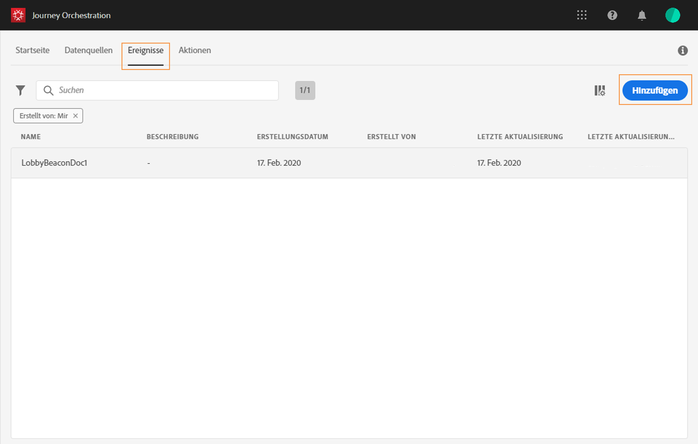
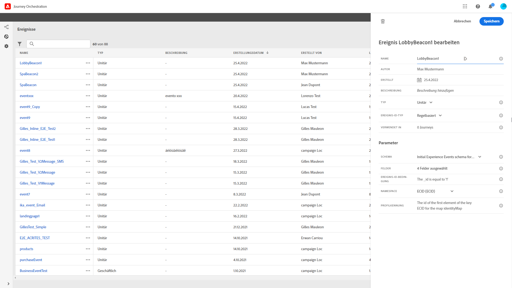
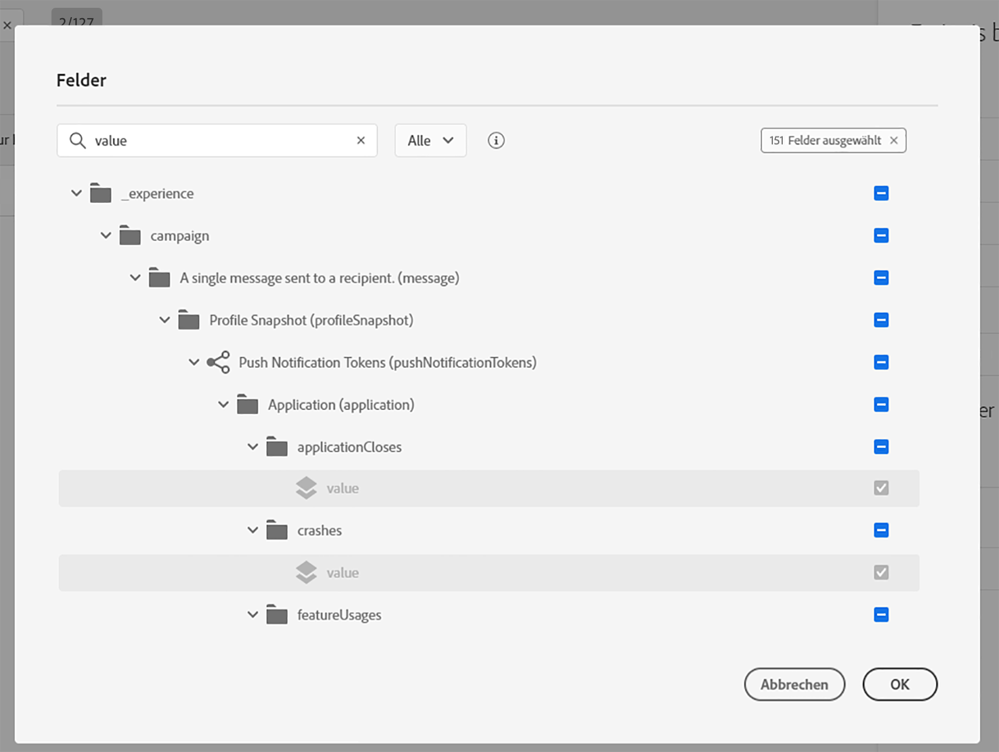
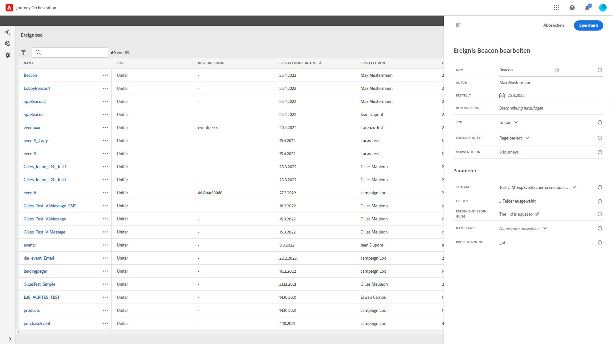
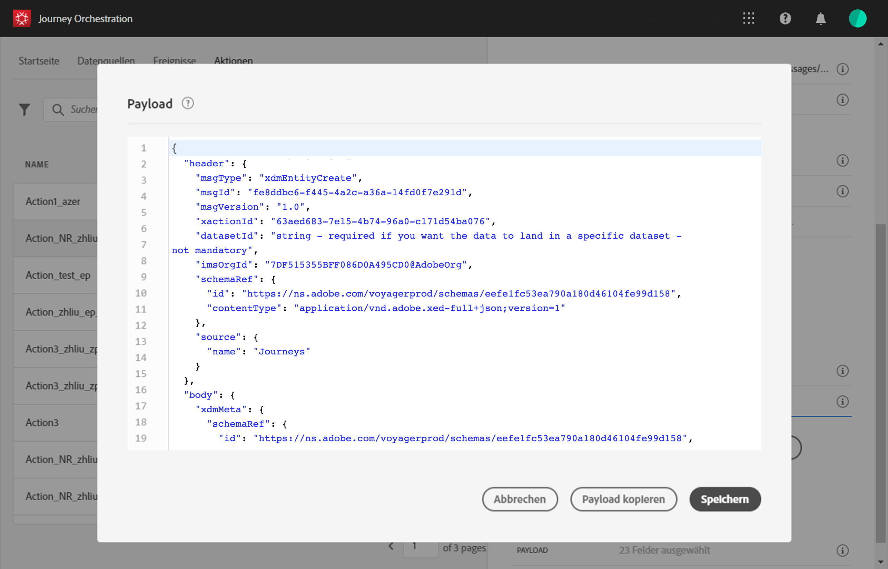

# Konfigurieren der Ereignisse {#concept_sbp_5cy_w2b}

In unserem Szenario wollen wir jedes Mal, wenn eine Person das Marlton-Hotel sowie das Restaurant betritt, ein Ereignis erhalten. Der **technische Anwender** muss die beiden Ereignisse konfigurieren, auf die das System in unserer Journey achten soll.

Weitere Informationen zur Ereigniskonfiguration finden Sie unter .

1. Klicken Sie im oberen Menü auf den Tab **[!UICONTROL Ereignisse]** und dann auf **[!UICONTROL Hinzufügen]**, um ein neues Ereignis zu erstellen.

   

1. Wir geben den Namen ohne Leer- oder Sonderzeichen ein: „LobbyBeacon“.

   

<!--li>Select the **[!UICONTROL Mobile - Streaming Ingestion APIs]** event type. Events are sent from the customers' mobile phone through the Mobile SDK.. Das System, das das Ereignis per Push sendet, sollte keine ID generieren. Es sollte die ID verwenden, die in der Payload-Vorschau verfügbar ist. In unserem Anwendungsfall dient diese ID zur Identifizierung des Beacon-Standorts. Jedes Mal, wenn eine Person den Lobby-Beacon passiert, wird ein Ereignis mit dieser bestimmten Ereignis-ID gesendet. Dasselbe gilt auch für Ereignisse für den Restaurant-Beacon. So kann das System erkennen, welcher Beacon das Senden des Ereignisses ausgelöst hat.

   

   >[!NOTE]
   >
   >Die Liste der Felder variiert von Schema zu Schema. Gemäß der Schemadefinition können einige Felder obligatorisch und vorausgewählt sein.

1. Wir müssen einen Namespace auswählen. Ein Namespace wird basierend auf Schemaeigenschaften vorab ausgewählt. Sie können die Auswahl beibehalten. Weitere Informationen zu Namespaces finden Sie unter .

   

1. Je nach den Schemaeigenschaften und dem ausgewählten Namespace wird ein Schlüssel vorausgewählt. Sie können ihn beibehalten.

   

1. Klicken Sie auf **[!UICONTROL Speichern]**.

1. Klicken Sie auf das Symbol **[!UICONTROL Payload zeigen]**, um eine Vorschau der vom System erwarteten Payload anzuzeigen und mit der Person zu teilen, die für das Senden des Ereignisses verantwortlich ist.  Diese Payload muss im Postback der Mobile Services-Administrationskonsole konfiguriert werden.

   

Auf gleiche Weise erstellen Sie das Ereignis „RestaurantBeacon“. Ihre beiden Beacon-Ereignisse wurden erstellt und können nun in der Journey genutzt werden. Jetzt müssen Sie die App so konfigurieren, dass sie die erwartete Payload an den Endpunkt der Streaming-Erfassungs-APIs senden kann. Siehe .
