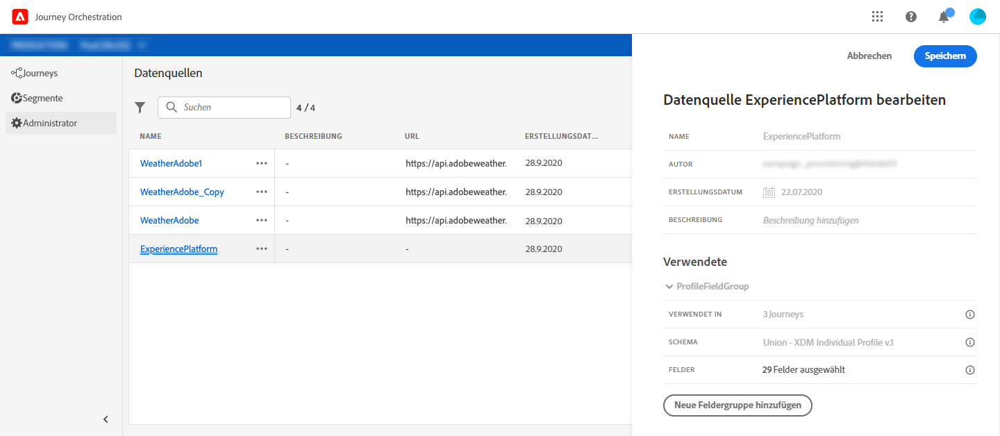
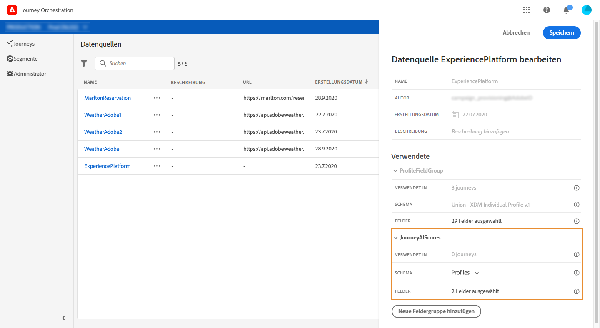
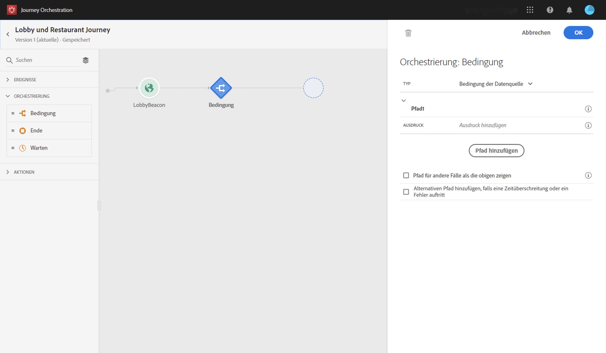
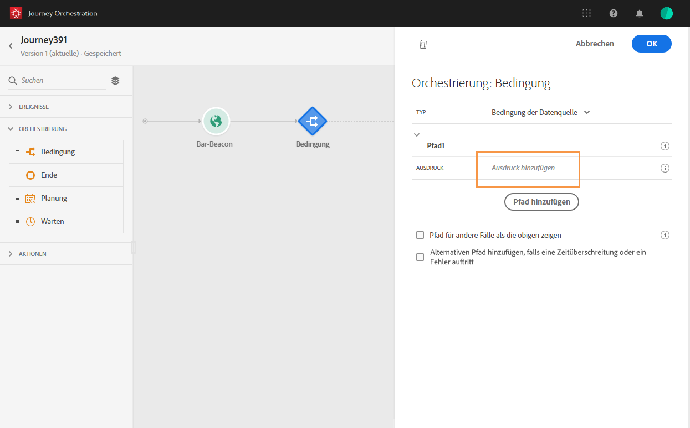
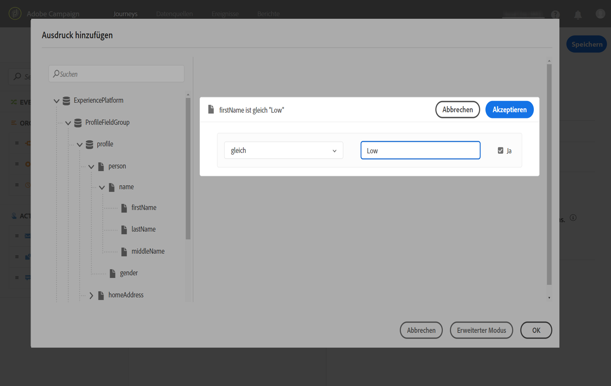
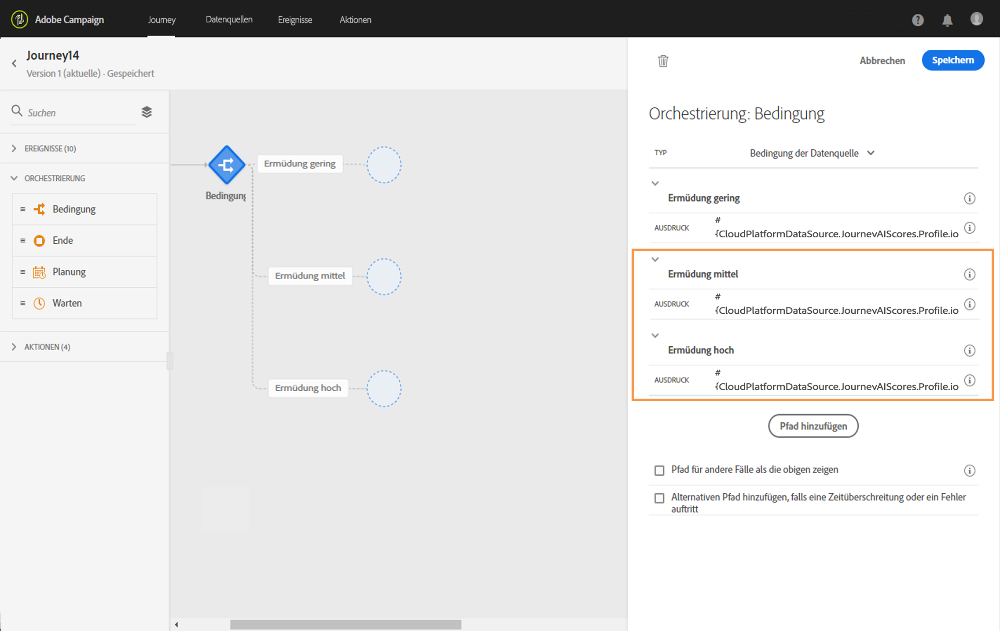
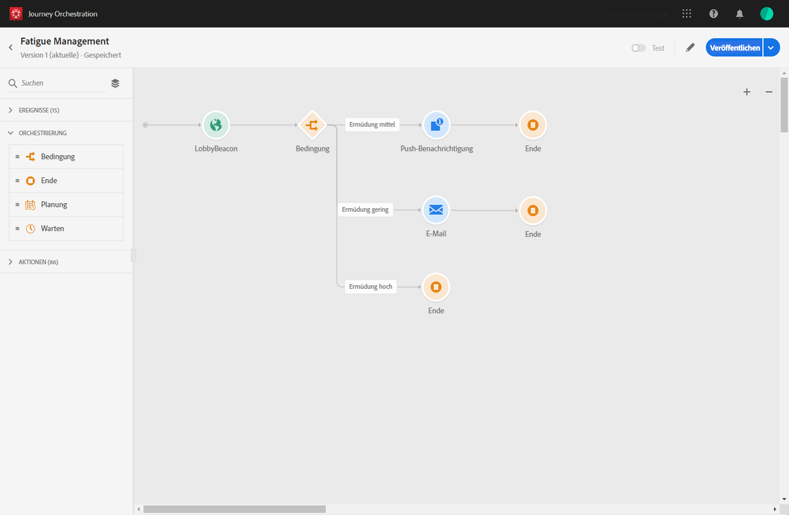

# Verwenden von Journey AI {#concept_dsh_1ry_wfb}

Dieser Anwendungsfall zeigt, wie Sie Ermüdungswerte verwenden können, um zu verhindern, dass Sie Kunden bei Journeys überfordern.

>[!NOTE]
>
>Die Funktion für prädiktive Ermüdungswerte steht nur Kunden zur Verfügung, die die Funktion Adobe Campaign Standard Data Service verwenden.

## Konfigurieren des Ereignisses {#section_ptb_ws1_ffb}

Befolgen Sie die Schritte unter [](../event/about-events.md).

## Konfigurieren der Datenquelle {#section_o3n_4yy_wfb}

Führen Sie folgende Schritte aus, um die Ermüdungswertfelder in der integrierten Datenquelle auszuwählen:

1. Klicken Sie im oberen Menü auf den Tab **[!UICONTROL Datenquellen]** und wählen Sie die integrierte Adobe Experience Platform-Datenquelle.

   

1. Vergewissern Sie sich, dass die für Ihre Anwendungsfälle erforderlichen Felder ausgewählt sind.
1. Klicken Sie auf **[!UICONTROL Neue Feldergruppe hinzufügen]**, wählen Sie das Modell **[!UICONTROL Profil]** und fügen Sie die Felder **[!UICONTROL fatigueLevel]** und **[!UICONTROL fatigueScore]** hinzu (unter _journeyAI > emailScore > fatigue_).

   

1. Klicken Sie auf **[!UICONTROL Speichern]**.

## Erstellen der Journey {#section_uzm_pyy_wfb}

Gehen Sie wie in [](../building-journeys/journey.md) beschrieben vor, um eine Journey zu erstellen, zu validieren und zu veröffentlichen.

In unserem Anwendungsfall nutzen wir das Feld **[!UICONTROL fatigueLevel]**. Sie können auch das Feld **[!UICONTROL fatigueScore]** verwenden.

Führen Sie folgende Schritte aus, um den Ermüdungsgrad Ihrer Journey zu nutzen:

1. Fügen Sie Ihrer Journey ein Ereignis und eine Bedingung hinzu.

   

1. Wählen Sie den Typ **[!UICONTROL Bedingung der Datenquelle]** und klicken Sie auf das Feld **[!UICONTROL Ausdruck]**.

   

1. Suchen Sie mithilfe des einfachen Ausdruckseditors nach dem Feld **[!UICONTROL fatigueLevel]** (_ExperiencePlatformDataSource > JourneyAIScores > Profile > journeyAI > emailScore > fatigue_), legen Sie es rechts ab und erstellen Sie folgende Bedingung: „fatigueLevel ist gleich &quot;Gering&quot;“. Bestätigen Sie die Aktion mit der Schaltfläche **[!UICONTROL OK]**.

   

   Der erweiterte Ausdruck lautet:

   ```
   #{ExperiencePlatformDataSource.JourneyAIScores.Profile.journeyAI.emailScore.fatigue.fatigueLevel} == "low"
   ```

1. Erstellen Sie in der Bedingung zwei weitere Pfade für einen mittleren und hohen Ermüdungsgrad.

   

1. Jetzt können Sie für jeden Ermüdungsgrad andere Aktionen hinzufügen.

   
