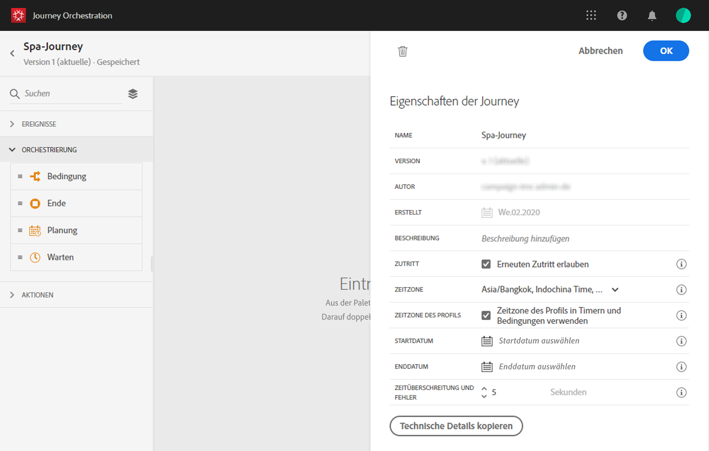
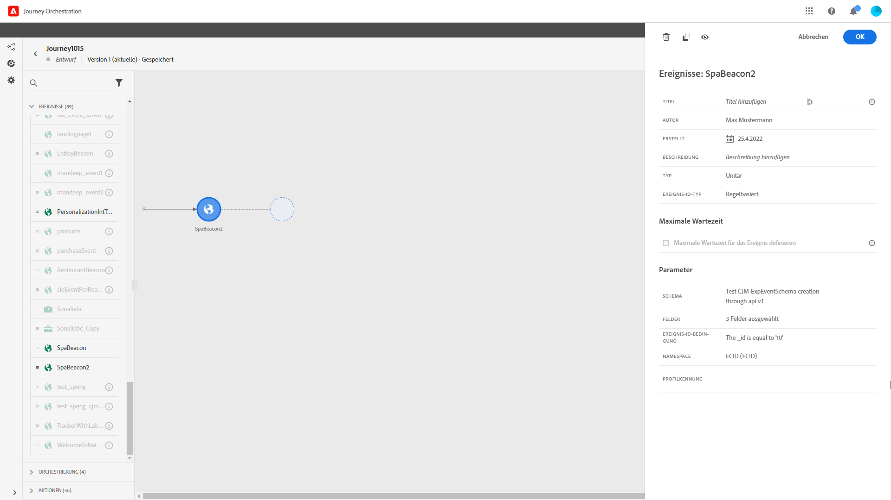
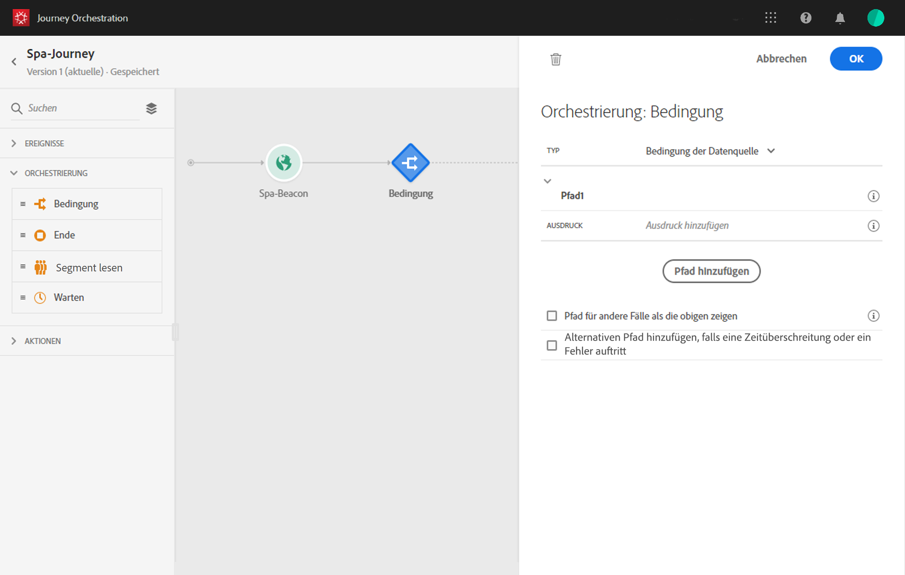
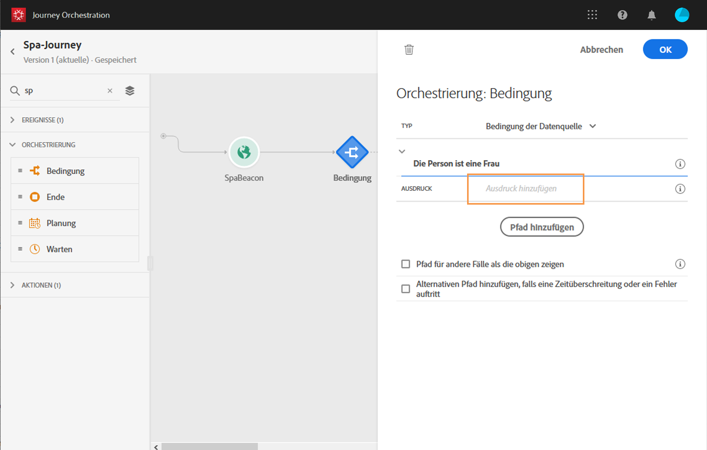
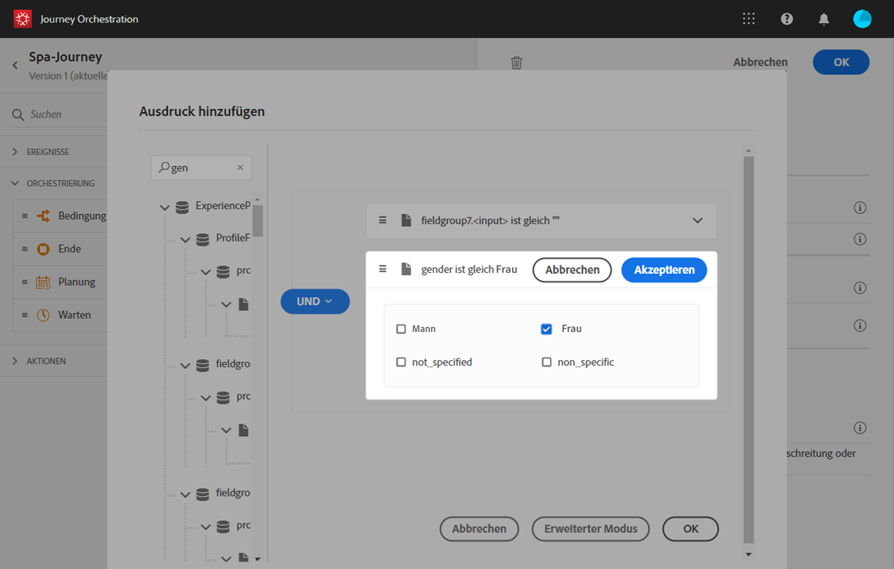
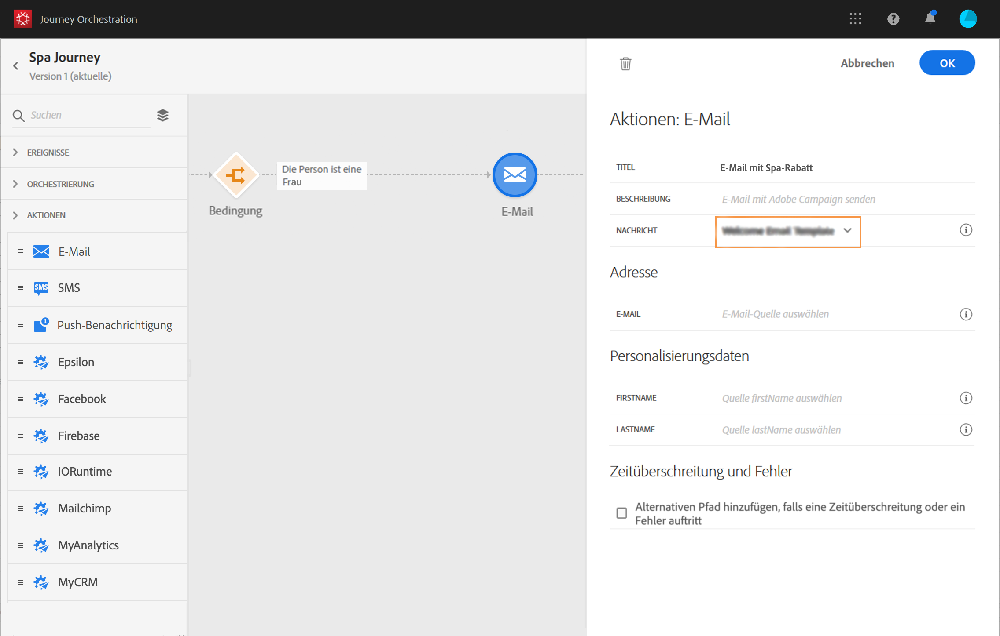
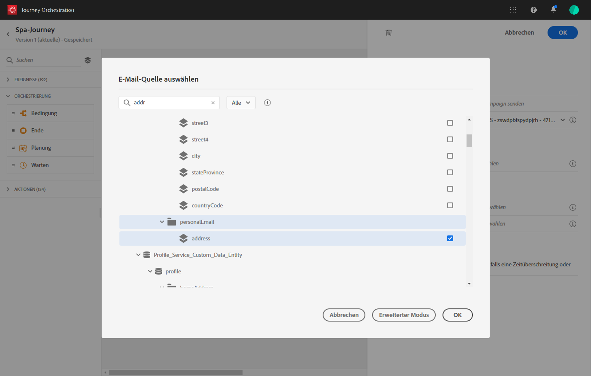
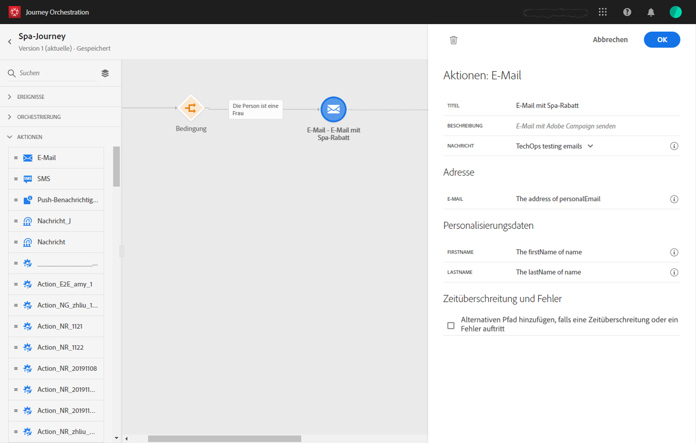
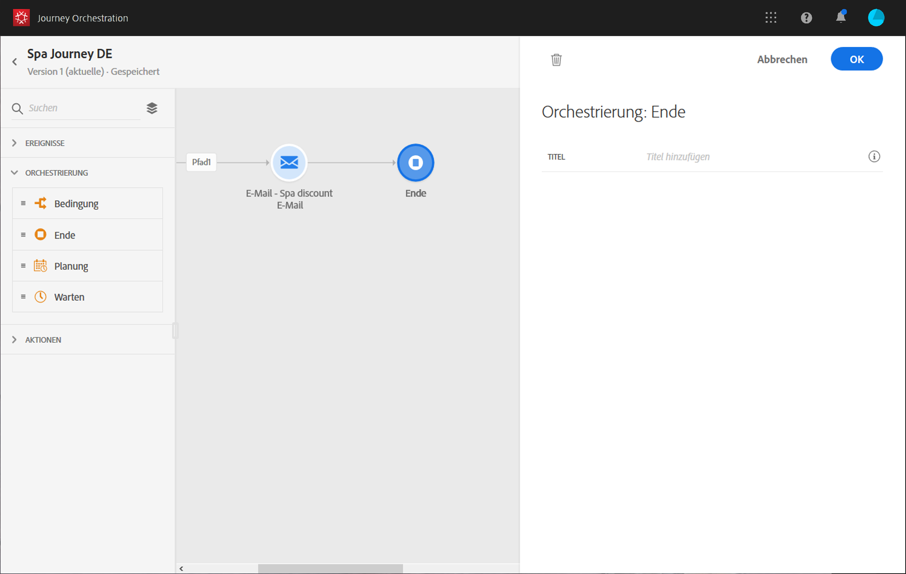
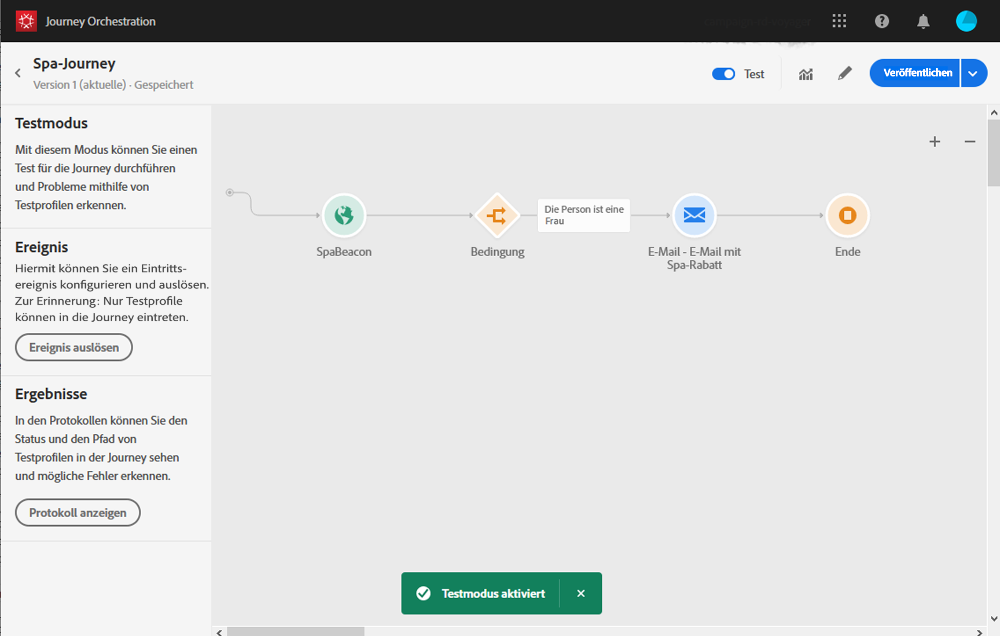

# Erstellen der Journey{#concept_eyw_mcy_w2b}

Der **Business-Anwender** kann nun die Journey einrichten. Unsere Journey enthält nur einen Pfad mit folgenden Aktivitäten:

* Ereignisaktivität **[!UICONTROL SpaBeacon]**: wenn eine Person den Spa-Beacon passiert, empfängt das System ein Ereignis und startet die Journey für diese Person
* **[!UICONTROL bedingte]** Aktivität, um zu überprüfen, ob die Person weiblich ist
* **[!UICONTROL E-Mail]**-Aktivität (mit Adobe Campaign Standard)
* Aktivität vom Typ **[!UICONTROL Ende]**

>[!NOTE]
>
>Die Aktivitäten **[!UICONTROL Push]** und **[!UICONTROL E-Mail]** sind in der Palette nur dann verfügbar, wenn Sie Adobe Campaign Standard verwenden.

Weitere Informationen zum Erstellen einer Journey finden Sie auf [dieser Seite](../building-journeys/journey.md).

1. Klicken Sie im oberen Menü auf den Tab **[!UICONTROL Startseite]** und dann auf **[!UICONTROL Erstellen]**, um eine neue Journey einzurichten.

   

1. Bearbeiten Sie im Konfigurationsbereich auf der rechten Seite die Eigenschaften der Journey. Wir vergeben den Namen „Spa-Journey“ und legen die Journey auf eine Dauer von einem Monat fest (vom 1. bis zum 31. Dezember).

   

1. Beginnen Sie mit der Gestaltung Ihrer Journey, indem Sie das Ereignis „SpaBeacon“ per Drag-and-Drop von der Palette auf die Arbeitsfläche ziehen. Alternativ können Sie in der Palette auf das Ereignis doppelklicken, um es der Arbeitsfläche hinzuzufügen.

   

1. Fügen wir nun eine Bedingung hinzu, um zu überprüfen, ob die Person weiblich ist. Ziehen Sie per Drag-and-Drop eine Bedingungsaktivität in die Journey.

   

1. Wählen Sie den Typ **[!UICONTROL Bedingung der Datenquelle]** und klicken Sie auf das Feld **[!UICONTROL Ausdruck]**. Alternativ können Sie eine Bedingungsbezeichnung definieren, die in der Arbeitsfläche auf dem Pfeil angezeigt wird.

   

1. Suchen Sie mit dem einfachen Ausdruckseditor nach dem Feld für das Geschlecht (_person > gender_) und legen Sie es rechts ab, um folgende Bedingung zu erstellen: „Geschlecht ist gleich ‚Frau‘“.

   

1. Legen Sie eine **[!UICONTROL E-Mail]**-Aktivität ab und wählen Sie die Transaktionsnachrichtenvorlage „Spa-Rabatt“. Diese Vorlage wurde mit Adobe Campaign entwickelt. Mehr dazu erfahren Sie auf [dieser Seite](https://docs.adobe.com/content/help/de-DE/campaign-standard/using/communication-channels/transactional-messaging/about-transactional-messaging.html).

   

1. Klicken Sie in das Feld **[!UICONTROL E-Mail]** und wählen Sie die E-Mail-Adresse aus der Datenquelle aus.

   

1. Definieren Sie auf dieselbe Weise die Personalisierungsfelder für Vorname und Nachname aus der Datenquelle.

   

1. Legen Sie eine Aktivität vom Typ **[!UICONTROL Ende]** ab.

   

1. Klicken Sie auf den Umschalter **[!UICONTROL Testen]**, um Ihre Journey mithilfe von Testprofilen zu testen. Wenn ein Fehler auftritt, deaktivieren Sie den Testmodus, ändern Sie Ihre Journey und testen Sie sie erneut. Weitere Informationen zum Testmodus finden Sie auf [dieser Seite](../building-journeys/testing-the-journey.md).

   

1. Nach Abschluss des Tests können Sie Ihre Journey über das Dropdown-Menü oben rechts veröffentlichen.

   

Wenn das nächste Mal eine Frau den Spa-Beacon passiert, erhält sie unmittelbar eine personalisierte E-Mail vom Typ „Spa-Rabatt“.
