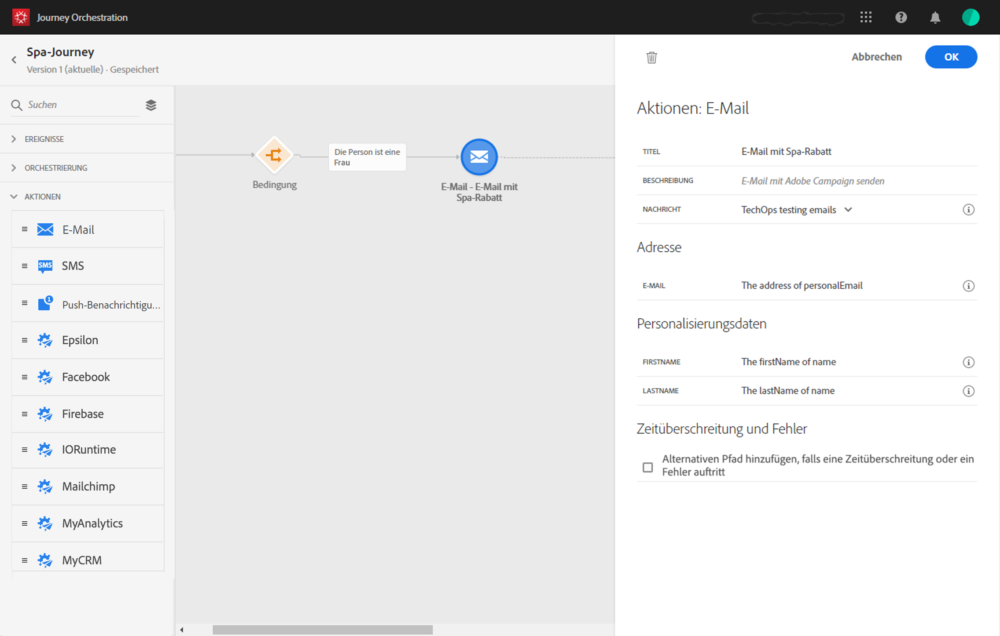

# Aufbau der Reise{#concept_eyw_mcy_w2b}

Der **Geschäftsbenutzer** kann nun die Reise gestalten. Unsere Reise umfasst nur einen Pfad mit folgenden Aktivitäten:

* das &quot;SpaBeacon&quot;- **[!UICONTROL Ereignis]**: wenn eine Person in der Nähe des Wellness-Beacons geht, erhält das System eine Veranstaltung und die Reise beginnt für diese Person.
* eine **[!UICONTROL bedingte]**Aktivität, um zu überprüfen, ob die Person eine Frau ist
* eine **[!UICONTROL E-Mail]**-Aktivität (mit Adobe Campaign Standard)
* Die Aktivität **[!UICONTROL Ende]**

>[!NOTE]
>
>Die **[!UICONTROL Aktivitäten &quot;Push]**&quot;und &quot;**[!UICONTROL  E-Mail]** &quot;stehen nur dann in der Palette zur Verfügung, wenn Sie über Adobe Campaign Standard verfügen.

Weitere Informationen zum Aufbau einer Reise finden Sie unter .

1. Klicken Sie im oberen Menü auf die Registerkarte **[!UICONTROL Start]**und**[!UICONTROL  Erstellen]** , um eine neue Reise zu erstellen.

   

1. Bearbeiten Sie die Eigenschaften der Reise im Konfigurationsbereich auf der rechten Seite. Wir nennen es &quot;Spa-Reise&quot; und legen sie auf einen Monat fest, vom 1. bis 31. Dezember.

   

1. Entwerfen Sie Ihre Reise mit Drag &amp; Drop des &quot;SpaBeacon&quot; Ereignisses von der Palette auf die Arbeitsfläche. Sie können auch auf das Ereignis in der Palette doppelklicken, um es der Arbeitsfläche hinzuzufügen.

   

1. Fügen wir nun eine Bedingung hinzu, um zu überprüfen, ob die Person eine Frau ist. Ziehen Sie eine Bedingungsaktivität per Drag &amp; Drop in Ihre Reise.

   

1. Wählen Sie den **[!UICONTROL Datenquellenbedingungstyp]**aus und klicken Sie auf das Feld**[!UICONTROL  Ausdruck]** . Sie können auch eine Bedingungsbeschriftung definieren, die auf dem Pfeil auf der Arbeitsfläche angezeigt wird.

   

1. Suchen Sie mit dem einfachen Ausdruckseditor nach dem Feld für das Geschlecht (_Person > Geschlecht_) und legen Sie es rechts ab, um die folgende Bedingung zu erstellen: &quot;Geschlecht ist gleich &quot;Weiblich&quot;.

   

1. Legen Sie eine **[!UICONTROL E-Mail]**-Aktivität ab und wählen Sie Ihre Transaktionsnachrichtenvorlage &quot;Spa-Rabatt&quot;. Diese Vorlage wurde mit Adobe Campaign entwickelt. Refer to this[page](https://docs.adobe.com/content/help/en/campaign-standard/using/communication-channels/transactional-messaging/about-transactional-messaging.html).

   

1. Klicken Sie in das Feld **[!UICONTROL E-Mail]**und wählen Sie die E-Mail-Adresse aus der Datenquelle aus.

   

1. Definieren Sie auf dieselbe Weise die Personalisierungsfelder für Vornamen und Nachnamen aus der Datenquelle.

   

1. Drop an **[!UICONTROL End]**activity.

   

1. Klicken Sie auf den **[!UICONTROL Test]**-Umschalter und testen Sie Ihre Reise mithilfe von Testprofilen. Wenn ein Fehler auftritt, deaktivieren Sie den Testmodus, ändern Sie Ihre Reise und testen Sie sie erneut. For more information on the test mode, refer to.

   

1. Wenn der Test abgeschlossen ist, können Sie Ihre Reise über das Dropdown-Menü oben rechts veröffentlichen.

   

Wenn eine Frau das nächste Mal in der Nähe des Wellness-Beacons geht, erhält sie sofort eine personalisierte E-Mail mit einem &quot;Spa-Rabatt&quot;.
